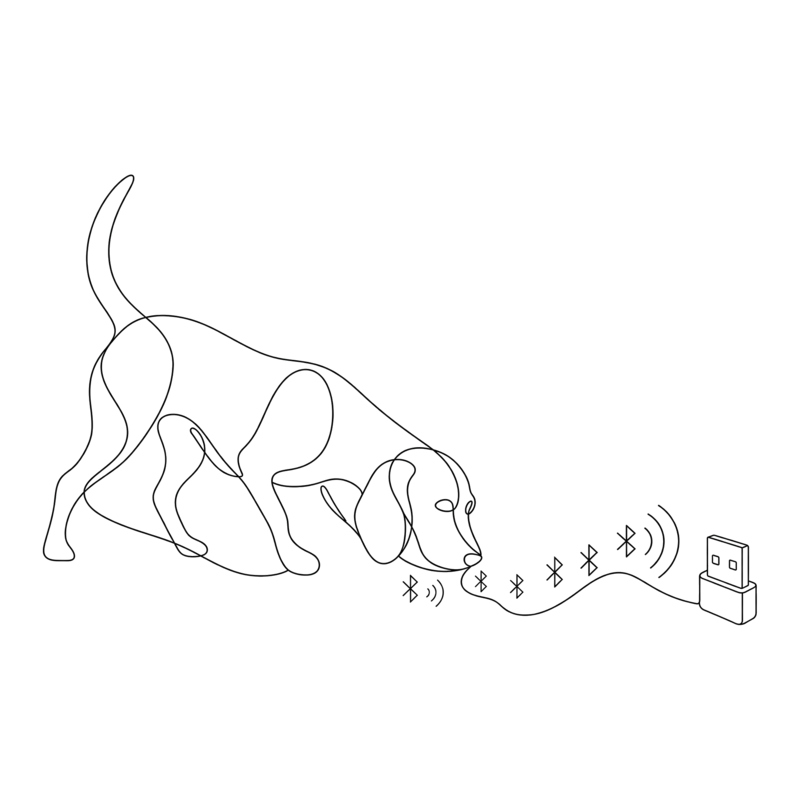

<p align="center">
  <picture>
    <source media="(prefers-color-scheme: dark)" srcset="docs/assets/logo-dark.png">
    
  </picture>
</p>

# BLE Packet Capture with a GeeekPi nRF52840 USB Dongle (Makerdiary MDK)

A walkthrough of getting the [GeeekPi nRF52840 Micro Dev Kit USB Dongle](https://www.amazon.com/dp/B07MJ12XLG) working as a BLE packet sniffer on macOS, producing Wireshark-compatible PCAPs.

Despite the GeeekPi branding, the actual hardware is a [Makerdiary nRF52840-MDK-USB-Dongle](https://wiki.makerdiary.com/nrf52840-mdk-usb-dongle/). This matters because Nordic's official tools (nRF Connect, the standard DFU flow) do not work with it. Multiple Amazon reviews call this out, but the working procedure is scattered. This README is the consolidated version.

The dongle ships preflashed with Nordic's connectivity firmware (VID `0x1915` / PID `0xc00a`) for use with `pc-ble-driver`. We replace that with Nordic's nRF Sniffer for Bluetooth LE 4.1.1 firmware and capture link-layer BLE traffic.

> Platform: macOS (Apple Silicon), Homebrew, Python 3.11 venv.

## Quick procedure

```bash
# 1. Tools
brew install --cask nrfutil
xattr -d com.apple.quarantine /opt/homebrew/bin/nrfutil   # unsigned binary
nrfutil install ble-sniffer nrf5sdk-tools

# 2. Get sniffer firmware
curl -fsSL -o /tmp/sniffer.zip \
  https://nsscprodmedia.blob.core.windows.net/prod/software-and-other-downloads/desktop-software/nrf-sniffer/sw/nrf_sniffer_for_bluetooth_le_4.1.1.zip
unzip /tmp/sniffer.zip -d ~/nrf-sniffer

# 3. Put dongle into UF2 bootloader.
#    Unplug, hold the reset button, plug back in. /Volumes/UF2BOOT will mount
#    and two green LEDs will turn on.

# 4. Convert hex to UF2 (Adafruit nRF52840 family ID)
curl -fsSL -o /tmp/uf2conv.py \
  https://raw.githubusercontent.com/microsoft/uf2/master/utils/uf2conv.py
python3 /tmp/uf2conv.py --family 0xADA52840 \
  --convert ~/nrf-sniffer/hex/sniffer_nrf52840dongle_nrf52840_4.1.1.hex \
  --output ~/nrf-sniffer/sniffer.uf2

# 5. Drag-flash
cp ~/nrf-sniffer/sniffer.uf2 /Volumes/UF2BOOT/
# Dongle reboots. `nrfutil device list` now shows:
#   Product: nRF Sniffer for Bluetooth LE

# 6. Capture
nrfutil ble-sniffer sniff \
  --port /dev/cu.usbmodem101 \
  --output-pcap-file ble_capture.pcap
```

## Gotchas

### The dongle is not a Nordic PCA10059

GeeekPi lists it as a generic "nRF52840 USB dongle." Mine reported Nordic's VID/PID in `system_profiler SPUSBDataType`, which is misleading. Once you enter the bootloader (hold reset, plug in) the `UF2BOOT` volume's `INFO_UF2.TXT` confirms what it actually is:

```
UF2 Bootloader 0.7.1 ...
Model: Makerdiary nRF52840 MDK USB Dongle
Board-ID: nRF52840-MDK-USB-DONGLE
```

### `nordicDfu` trait does not mean buttonless DFU works

`nrfutil device list` reports `Traits: nordicDfu, nordicUsb, ...`, which is inferred from the USB VID, not from any DFU service the running firmware actually exposes. Attempting `nrfutil device program --traits nordicDfu` against the stock connectivity firmware just times out:

```
Error: Internal sdfu error: Wait device connected failed:
  Device event timeout, waiting for event SerialArrived
```

The fix is physical. Unplug, hold the reset button, plug back in, release. Two solid green LEDs and a `UF2BOOT` USB drive mean you are in.

### UF2 family IDs matter

`uf2conv.py` defaults to the Microsoft family table. The Makerdiary MDK bootloader expects Adafruit's nRF52840 family ID `0xADA52840`, not Microsoft's `0x1b57745f`. Wrong family ID and the file just sits on `UF2BOOT` and never flashes. Right family ID and the bootloader reboots mid-copy. You will see `cp: fcopyfile failed: Input/output error`. That is success, not failure.

If your hex starts at address `0x2000` instead of `0x1000`, pass `-b 0x1000` to `uf2conv.py`. Several Amazon reviewers got stuck on this. The Nordic sniffer hex already has the right start address, so it works without `-b`.

### Legacy `nrfutil pkg` is broken on Python 3

The PyPI `nrfutil==5.2.0` package still has Py2-isms (`.iteritems()`, `xrange`). Do not bother patching it. For DFU package generation use either:

- `nrfutil nrf5sdk-tools pkg generate ...` (modern nrfutil 8.x), or
- `adafruit-nrfutil` (Adafruit's maintained fork).

Both are moot here. With a UF2 bootloader, no DFU zip is required at all.

### Modern nrfutil binary is unsigned on macOS

The Homebrew cask installs without code signing. macOS Gatekeeper blocks it on first run with "Apple could not verify...". Click Done (not Move to Trash), then:

```bash
xattr -d com.apple.quarantine /opt/homebrew/bin/nrfutil
```

## Verifying the capture

```bash
$ file ble_capture.pcap
ble_capture.pcap: pcap capture file, microseconds ts (big-endian) - version 2.4
  (Nordic Semiconductor Bluetooth LE sniffer frames, capture length 65535)
```

First packet body:

```
1bff 4c00 0c0e 00db ...
```

`ff` is the manufacturer-specific AD type, `4c00` is Apple Inc., so this is an iPhone Continuity / AirDrop / Handoff advertisement.

To use with Wireshark and the official extcap plugin, drop `nrf_sniffer_ble.py` from the Nordic sniffer zip's `extcap/` folder into Wireshark's extcap directory (`/Applications/Wireshark.app/Contents/MacOS/extcap` on macOS) and `pip install -r extcap/requirements.txt`. The `nrfutil ble-sniffer sniff` command above is a CLI alternative that produces the same PCAP format.

## Restoring connectivity firmware

The original `pc-ble-driver` connectivity firmware lives in the [`pc-ble-driver` releases](https://github.com/NordicSemiconductor/pc-ble-driver/releases) as `.hex`. Convert with the same UF2 family ID and drag it back onto `UF2BOOT`.

## What Amazon reviewers said

Independent confirmation of the procedure from the [product listing](https://www.amazon.com/dp/B07MJ12XLG):

- Chris Majestic (5★): "this is the MakerDiary version of the nRF52840... Nordic's nRF Connect software won't flash it... Hold the button while plugging it in... UF2BOOT... Convert the HEX file to UF2 using Microsoft's UF2 converter script."
- SteveD (4★): hit the address offset gotcha. "the default application address for UFL bootloader is 0x1000. The default address for the recommended uf2conv utility is 0x2000... Re-ran the uf2conv with `-b 0x1000`, sent the resulting file to the dongle, voila it works."
- mm (3★, updated): notes that BLE sniffer is the easy path. "if you're only looking to use this as a ble sniffer with wireshark, tcdump, etc... you can get this going more easily."
- Jason Lawson (5★): "Manufacturer is Makerdiary."

## Environment

Tested on macOS 15 (Darwin 24.6), nrfutil 8.2.0, nrf-sniffer 4.1.1, Makerdiary nRF52840-MDK-USB-Dongle bootloader 0.7.1. Captured 2026-05-13.
